# 农产品供销管理系统
## 项目概述
本项目,可作为一个练手项目学习,虽然代码写的有点烂。但是还是能够作为管理系统能够使用学习的。该项目大部分是可复用的,供大家学习使用,不喜勿喷。


## 涉及用到的技术栈

(浅浅说一下,我们拿了fisco-bcos的数据，但是并没有部署合约,就是只实现了区块链网络监控的效果。但是封装了2连接工具类,开箱即用，看下面图片。

再提一句,Druid连接池跟fisco-java-sdk冲突,我合约交互用的WeFrontService来实现,因此数据库配置那里就没改,如果想用ContractService,就是将数据库连接池配置改成其他连接池配置)

`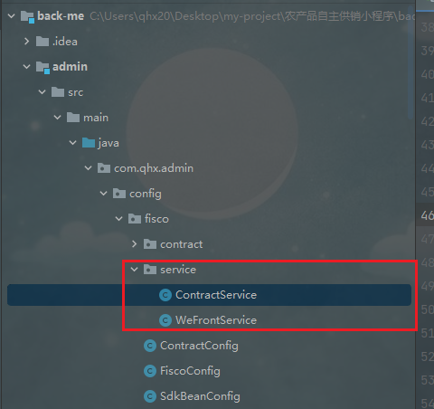

服务端：SpringBoot、SpringSecurity、Mybatis-plus、Redis、Fisco-Bcos、Druid、Hutool、阿里云OSS

客户端：Vue、Vuex、Vue-router、Element-UI、Echars

## 安装使用

先说一下,本系统,用到了Fisco-bcos的中间件平台webase的子系统webase-front。这里不做赘述。
back-me为后端工程目录、front-me为前端工程目录

服务端：

1.fisco配置更改：

将下图fisco配置更改为自己搭建的fisco链、webase-front配置。如果要进行合约部署,并且要用WeFrontService合约交互，将合约配置里面填上

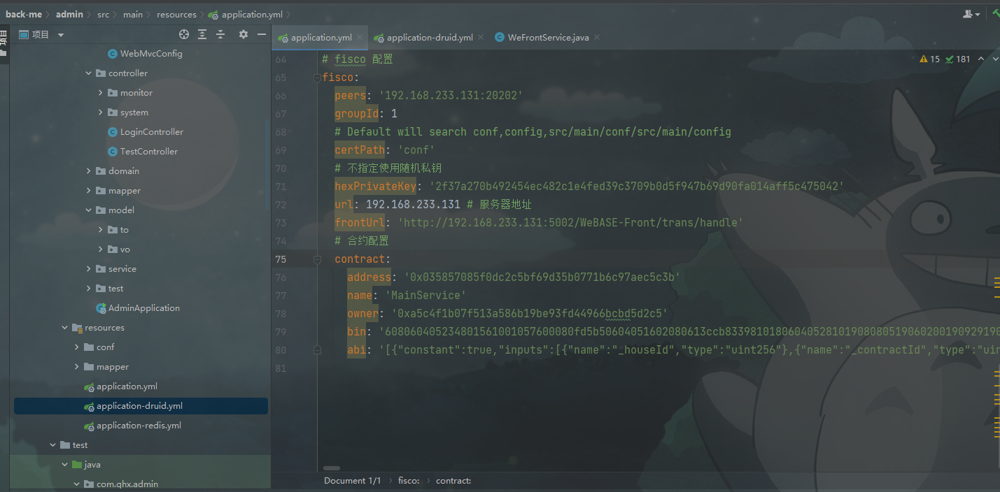

2.在back-me的admin模块下的application-druid.yml 、application-redis.yml更改MySQL、Redis服务器的连接配置。本地运行创建ap数据库运行ap.sql文件。

3.德鲁伊监控配置更改：

在common模块下面,该位置。默认是账号：admin,密码: 123456

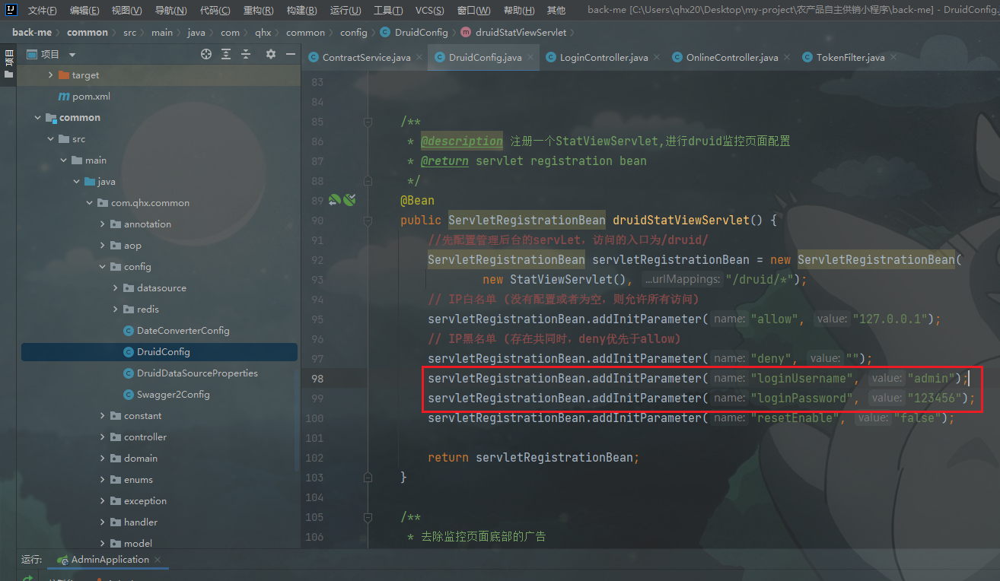

4.阿里云OSS配置更改。在common模块下面util包下面的OSSUtil更改自己的配置。

5.swagger配置修改：ctrl + n全局搜索,Swagger2Config文件,更改为自己配置

登录系统之后,访问http://localhost:8110/swagger-ui.html进入以下页面。

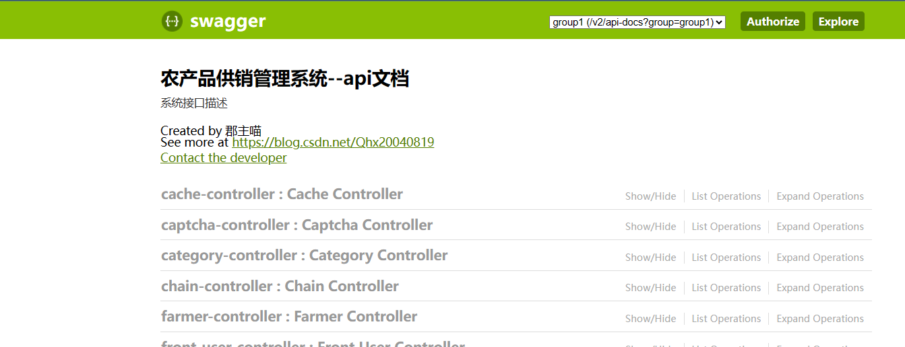

默认无法接口调用,需要：随便一个点击接口调用,点击红色叹号、填写Bearer+登录token、点击Authorize之后,即可请求携带token，才能进行接口调用。

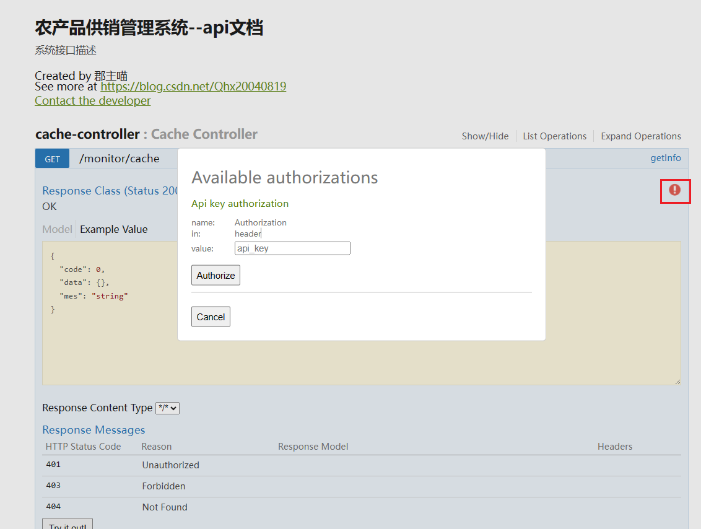

启动back-me项目下面admin模块

客户端：
用控制台打开front-me目录下的front-admin目录
```
# 先执行
npm i
# 之后执行
npm run serve
```


## 项目演示

这里只演示部分页面

### 项目视频演示
视频项目标题因需求改了。但实际一个项目。

[assets/show.mp4](https://github.com/junzhumiao/goods-manage/assets/119744044/45ecc7f6-5fc0-4420-94de-2796ec882ff2)


### 登录

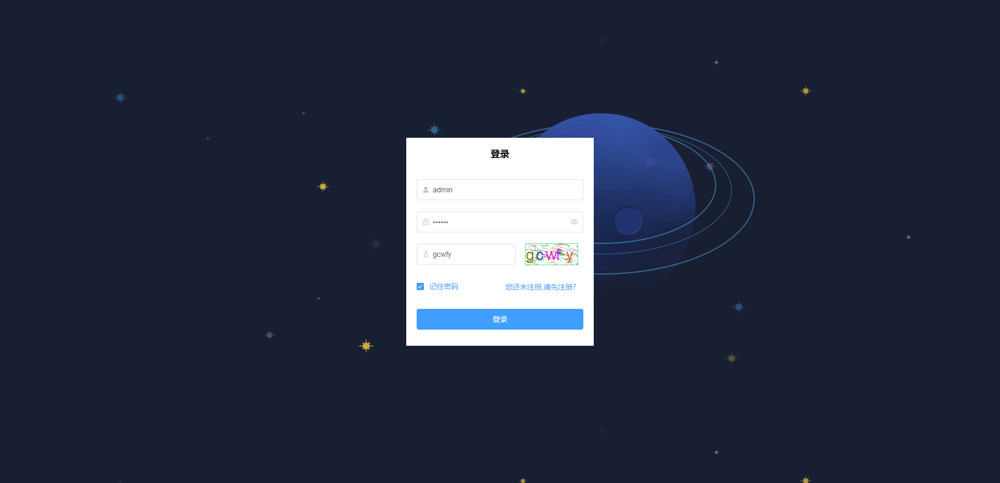

### 注册

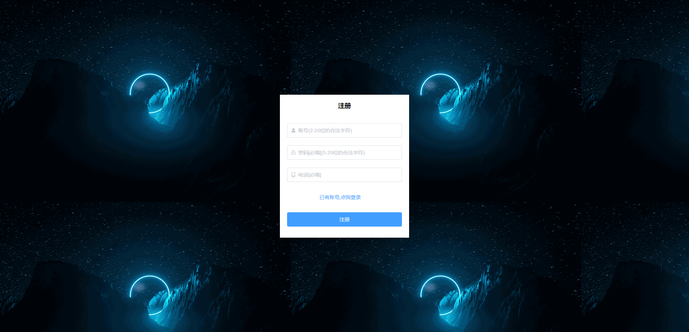

### 首页

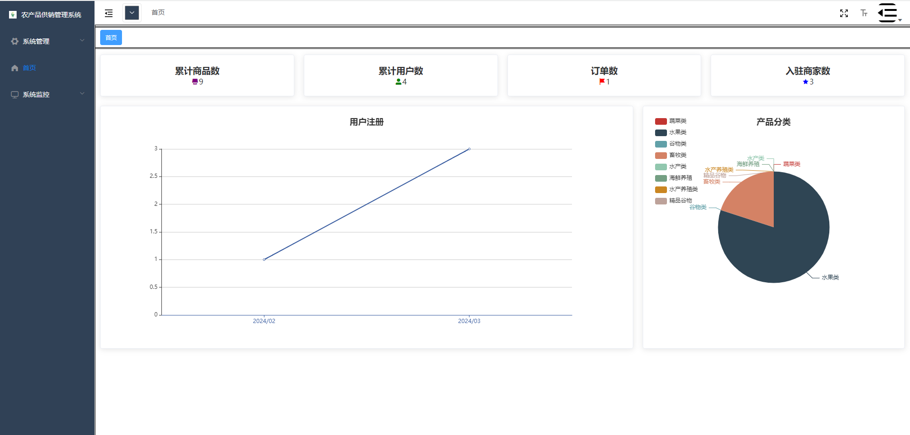

### 用户管理

就是展示一些前台用户信息,还有对用户的增删改查。

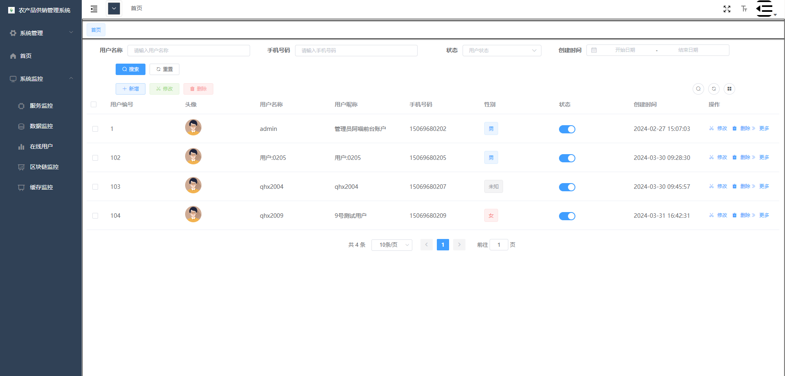

### 服务监控

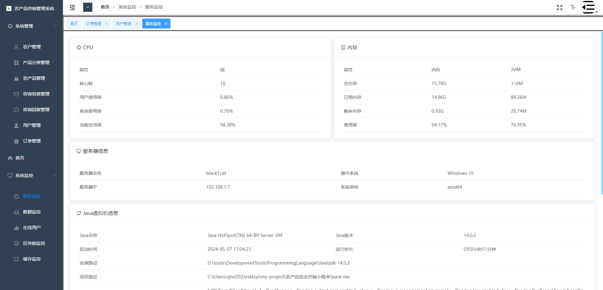

### 区块链监控

输入块高,点击查询,可显示区块信息

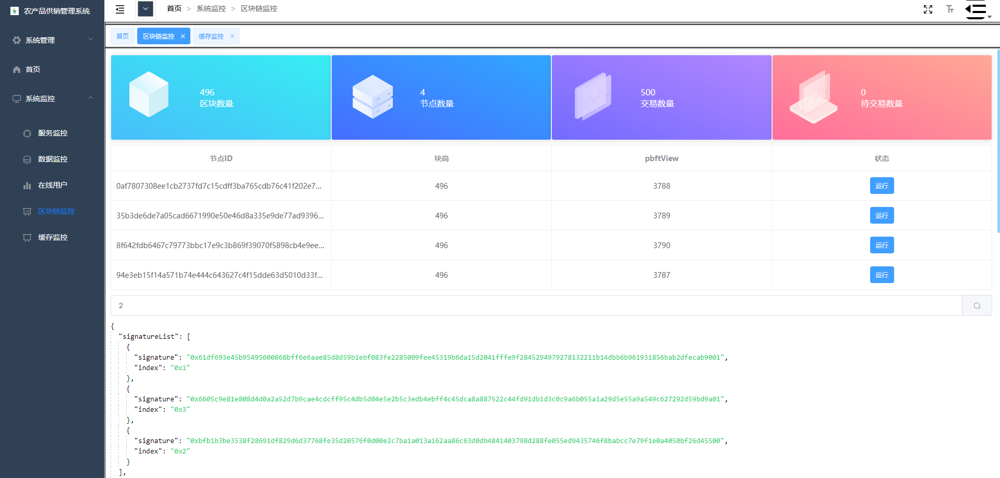

### 缓存监控

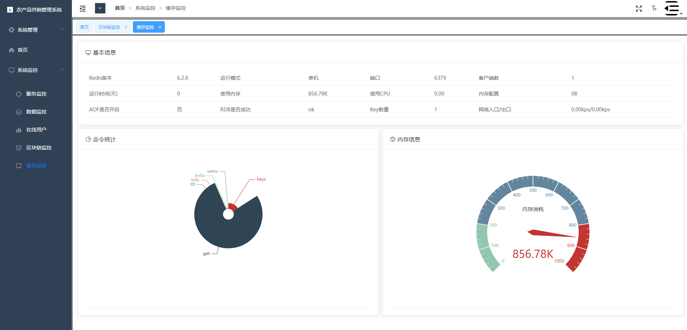

### 个人中心

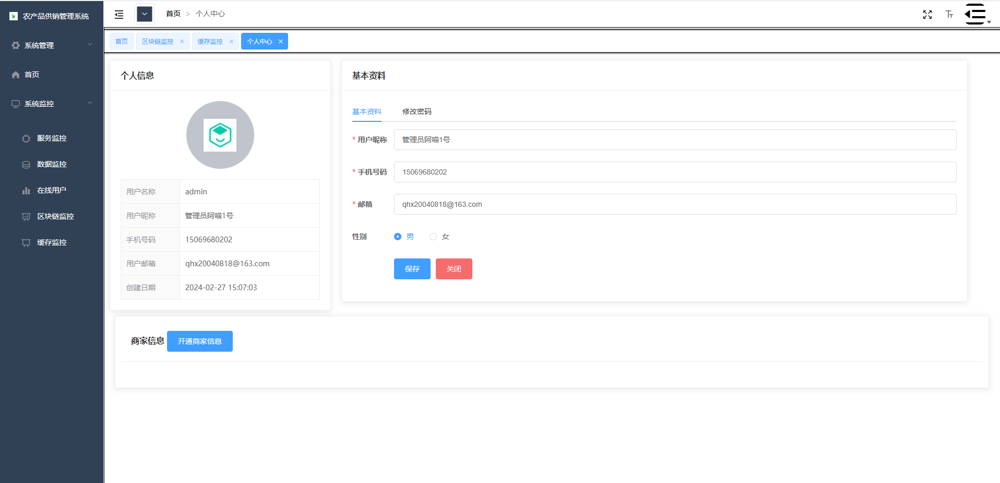
